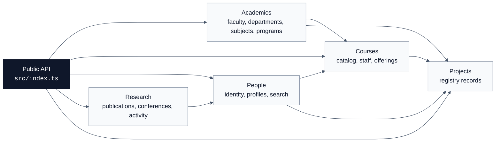

# Academic Domain Schemas Docs

Shared schema contracts for Faculty of Science academic data. These docs
explain the shape of the package the way maintainers need it: what each domain
owns, how schemas depend on each other, and where to make the next change.

## Start Here

| Need                                                        | Open                          |
| ----------------------------------------------------------- | ----------------------------- |
| Check what the package exports                              | [Public API](./public-api.md) |
| Change faculty, departments, units, subjects, or programmes | [Academics](./academics.md)   |
| Change course catalog or offerings                          | [Courses](./courses.md)       |
| Change students, staff, search, or social links             | [People](./people.md)         |
| Change project registry records                             | [Projects](./projects.md)     |
| Change publications, conferences, or research entries       | [Research](./research.md)     |
| Prepare a versioned package release                         | [Release](./release.md)       |

## Schema Landscape



## Domain Cards

| Domain                      | Owns                                                            | Depends On                    | Used By                        |
| --------------------------- | --------------------------------------------------------------- | ----------------------------- | ------------------------------ |
| [Academics](./academics.md) | Faculty, departments, units, subjects, years, periods, programs | None                          | Courses, people, projects      |
| [Courses](./courses.md)     | Course codes, catalog records, offerings                        | Academics, people identifiers | Projects, course data          |
| [People](./people.md)       | Persons, students, staff, search, social links                  | Research for profile content  | Courses, projects              |
| [Projects](./projects.md)   | Project registry records and project metadata                   | Academics, courses, people    | Public project registry        |
| [Research](./research.md)   | Publications, conferences, research activity                    | None                          | People profiles, project links |

## Change Workflow

1. Open the domain page for the schema you are changing.
2. Follow the diagram to see direct consumers.
3. Update [Public API](./public-api.md) when an exported schema, type, catalogue, or helper
   changes.
4. Keep the contract test aligned:
   [`tests/contract/public-api.test.ts`](../tests/contract/public-api.test.ts).
5. Run the package checks before delivery.

```sh
bun run lint
bun run format:check
bun run typecheck
bun run typecheck:test
bun test --coverage
bun run build
bun run knip
```

See [Release And Publishing](./release.md) before publishing a package version.

## Documentation Standard

Each domain page should stay short, navigable, and source-grounded:

- link every source file it describes,
- show relationships with Mermaid,
- call out validation rules that affect consumers,
- keep future notes about ownership and migration risk.
