# Academics Schemas

[Docs home](./README.md) | [Public API](./public-api.md) | [Courses](./courses.md) | [People](./people.md) | [Projects](./projects.md) | [Research](./research.md)

The academics domain contains reusable academic calendar, organization, and
programme shapes. It is consumed by [Courses](./courses.md) and
[Projects](./projects.md).

## Quick Read

| Schema                           | Purpose                              | Key Rule                                          |
| -------------------------------- | ------------------------------------ | ------------------------------------------------- |
| `AcademicYearSchema`             | Numeric or range-based academic year | Range strings must be `YYYY/YYYY` and sequential. |
| `AcademicPeriodSchema`           | Academic year plus semester          | Semester is limited to `SEM1` or `SEM2`.          |
| `FacultyCodeSchema`              | Faculty vocabulary                   | Currently models the Faculty of Science.          |
| `AcademicDepartmentCodeSchema`   | Academic department vocabulary       | Contains the nine Faculty of Science departments. |
| `AcademicUnitCodeSchema`         | Academic unit vocabulary             | Contains the two Faculty of Science units.        |
| `AcademicSubjectCodeSchema`      | General subject vocabulary           | Contains selectable B.Sc. subject areas only.     |
| `AcademicSubjectSelectionSchema` | Subject selection rule               | Requires 2-3 unique selectable subjects.          |
| `AcademicDepartmentSchema`       | Department metadata                  | References a faculty by code.                     |
| `AcademicUnitSchema`             | Unit metadata                        | References a faculty by code.                     |
| `AcademicSubjectSchema`          | Subject metadata                     | Can link subject areas to owning departments.     |
| `ProgramSchema`                  | Degree programme variant             | Discriminated by `code`.                          |
| `HonoursProgrammeCodeSchema`     | Honours programme vocabulary         | Attached to academic departments.                 |
| `HonoursStreamSchema`            | Honours programme alias              | Backward-compatible alias for honours programmes. |
| `ScienceAcademicDepartments`     | Science department catalogue         | Hardcodes department to honours programme links.  |
| `ScienceAcademicSubjects`        | Science subject catalogue            | Hardcodes subject to department links.            |
| `ScienceAcademicUnits`           | Science unit catalogue               | Hardcodes Faculty of Science units.               |

## Source Files

- [`academic-year.schema.ts`](../src/schemas/academics/academic-year.schema.ts)
- [`academic-period.schema.ts`](../src/schemas/academics/academic-period.schema.ts)
- [`academic-organization.schema.ts`](../src/schemas/academics/academic-organization.schema.ts)
- [`academic-program.schema.ts`](../src/schemas/academics/academic-program.schema.ts)

## Relationship Diagram

```mermaid
%%{init: {"theme": "base", "themeVariables": {"primaryColor": "#f8fafc", "primaryTextColor": "#0f172a", "primaryBorderColor": "#64748b", "lineColor": "#475569"}}}%%
flowchart TD
  AcademicYearSchema["AcademicYearSchema<br/>number 1900..2200 or YYYY/YYYY"]
  AcademicPeriodSchema["AcademicPeriodSchema<br/>year + SEM1|SEM2"]
  FacultyCodeSchema["FacultyCodeSchema<br/>SCIENCE"]
  AcademicDepartmentCodeSchema["AcademicDepartmentCodeSchema<br/>Science departments"]
  AcademicUnitCodeSchema["AcademicUnitCodeSchema<br/>Science units"]
  HonoursProgrammeCodeSchema["HonoursProgrammeCodeSchema<br/>honours programmes"]
  AcademicSubjectCodeSchema["AcademicSubjectCodeSchema<br/>general B.Sc. subjects"]
  AcademicSubjectSelectionSchema["AcademicSubjectSelectionSchema<br/>2-3 unique subjects"]
  AcademicDepartmentSchema["AcademicDepartmentSchema"]
  AcademicUnitSchema["AcademicUnitSchema"]
  AcademicSubjectSchema["AcademicSubjectSchema"]
  HonoursStreamSchema["HonoursStreamSchema<br/>honours alias"]
  ProgramSchema["ProgramSchema<br/>GENERAL|HONOURS|APPLIED_SCIENCES|SOR"]
  CourseOfferingSchema["CourseOfferingSchema"]
  ProjectCourseSchema["ProjectCourseSchema"]
  ProjectSchema["ProjectSchema"]

  AcademicYearSchema --> AcademicPeriodSchema
  FacultyCodeSchema --> AcademicDepartmentSchema
  FacultyCodeSchema --> AcademicUnitSchema
  AcademicDepartmentCodeSchema --> AcademicDepartmentSchema
  HonoursProgrammeCodeSchema --> AcademicDepartmentSchema
  AcademicDepartmentCodeSchema --> AcademicSubjectSchema
  AcademicSubjectCodeSchema --> AcademicSubjectSchema
  AcademicSubjectCodeSchema --> AcademicSubjectSelectionSchema
  AcademicSubjectSelectionSchema --> ProgramSchema
  HonoursProgrammeCodeSchema --> ProgramSchema
  HonoursProgrammeCodeSchema --> HonoursStreamSchema
  AcademicYearSchema --> CourseOfferingSchema
  AcademicYearSchema --> ProjectCourseSchema
  AcademicYearSchema --> ProjectSchema

  click CourseOfferingSchema "./courses.md" "Course offering docs"
  click ProjectCourseSchema "./projects.md" "Project docs"
  click ProjectSchema "./projects.md" "Project docs"

  classDef core fill:#0f172a,color:#ffffff,stroke:#0f172a
  classDef consumer fill:#f8fafc,color:#0f172a,stroke:#64748b
  class AcademicYearSchema,AcademicPeriodSchema,FacultyCodeSchema,AcademicDepartmentCodeSchema,AcademicUnitCodeSchema,HonoursProgrammeCodeSchema,AcademicSubjectCodeSchema,AcademicSubjectSelectionSchema,AcademicDepartmentSchema,AcademicUnitSchema,AcademicSubjectSchema,HonoursStreamSchema,ProgramSchema core
  class CourseOfferingSchema,ProjectCourseSchema,ProjectSchema consumer
```

## Schemas

### AcademicYearSchema

Accepts either:

- an integer academic year between `1900` and `2200`,
- a range string in `YYYY/YYYY` format where the second year immediately follows
  the first year.

Use it whenever data needs a year marker but different repositories may still
send either compact numeric years or explicit ranges.

### AcademicPeriodSchema

Combines `AcademicYearSchema` with a semester enum:

- `SEM1`
- `SEM2`

Use it for time slices that require both the academic year and the semester.

### FacultyCodeSchema

Controlled faculty codes:

- `SCIENCE`

### AcademicDepartmentCodeSchema

Controlled Faculty of Science departments:

- `BOTANY`
- `CHEMISTRY`
- `ENVIRONMENTAL_AND_INDUSTRIAL_SCIENCES`
- `GEOLOGY`
- `MATHEMATICS`
- `MOLECULAR_BIOLOGY_AND_BIOTECHNOLOGY`
- `PHYSICS`
- `STATISTICS_AND_COMPUTER_SCIENCE`
- `ZOOLOGY`

### AcademicUnitCodeSchema

Controlled Faculty of Science units:

- `COMPUTER_UNIT`
- `SCIENCE_EDUCATION_UNIT`

### AcademicSubjectCodeSchema

Controlled subject areas include only selectable B.Sc. subject areas. The
handbook's `Biology*`, `Biology**`, `Mathematics*`, and `Mathematics**`
principal subject areas are represented as `BIOLOGY_SINGLE`, `BIOLOGY_DOUBLE`,
`MATHEMATICS_SINGLE`, and `MATHEMATICS_DOUBLE`. The plain `MATHEMATICS` code is
also available for programme combinations such as Statistics and Operations
Research.

Use department codes for organization ownership and subject codes for what a
general B.Sc. student can select.

### AcademicSubjectSelectionSchema

Reusable undergraduate subject-selection rule:

- minimum 2 subjects,
- maximum 3 subjects,
- no duplicate subjects.

### HonoursProgrammeCodeSchema

Controlled honours programmes:

- `BIOMEDICAL_SCIENCE`
- `BOTANY`
- `CHEMISTRY`
- `COMPUTER_SCIENCE`
- `DATA_SCIENCE`
- `ENVIRONMENTAL_SCIENCE`
- `GEOLOGY`
- `MATHEMATICS`
- `MICROBIOLOGY`
- `MOLECULAR_BIOLOGY_AND_BIOTECHNOLOGY`
- `PHYSICS`
- `STATISTICS`
- `STATISTICS_AND_OPERATIONS_RESEARCH`
- `ZOOLOGY`

### HonoursStreamSchema

Backward-compatible alias for `HonoursProgrammeCodeSchema`.

### ProgramSchema

Discriminated by `code`:

- `GENERAL`: `BSc`, 3 years, requires 2-3 unique selectable subjects.
- `HONOURS`: `BSc(Hons)`, 4 years, requires 2-3 unique selectable subjects
  and `honoursProgramme`.
- `APPLIED_SCIENCES`: `BSc(Hons) Applied Sciences`, 4 years, requires 2-3
  unique selectable subjects.
- `SOR`: `BSc(Hons) Statistics and Operations Research`, 4 years, requires
  `STATISTICS` and `MATHEMATICS`, may include `COMPUTER_SCIENCE`, and defaults
  `honoursProgramme` to `STATISTICS_AND_OPERATIONS_RESEARCH`.

### Hardcoded Science Catalogue

Use these exports when consumers need the canonical ownership data:

- `HonoursProgrammeDepartmentMap`: maps each honours programme to its owning
  academic department. For example, `COMPUTER_SCIENCE`, `DATA_SCIENCE`,
  `STATISTICS`, and `STATISTICS_AND_OPERATIONS_RESEARCH` map to
  `STATISTICS_AND_COMPUTER_SCIENCE`.
- `AcademicSubjectDepartmentMap`: maps each selectable subject to one or more
  teaching departments. For example, `MATHEMATICS`, `MATHEMATICS_SINGLE`, and
  `MATHEMATICS_DOUBLE` map to `MATHEMATICS`; `BIOLOGY_SINGLE` and
  `BIOLOGY_DOUBLE` map to `BOTANY`, `MOLECULAR_BIOLOGY_AND_BIOTECHNOLOGY`, and
  `ZOOLOGY`.
- `ScienceAcademicDepartments`, `ScienceAcademicSubjects`, and
  `ScienceAcademicUnits`: ready-to-use catalogue arrays validated by the
  schemas above.

## Future Notes

- Add new semesters only after checking consumers that assume `SEM1` and `SEM2`.
- Add programme variants through `ProgramSchema` so downstream code can safely
  branch on the `code` discriminator.
- Keep departments, units, and subject areas separate. A department is an
  organization unit tied to a faculty; a subject area is what a general
  programme or student studies. A subject can be linked to multiple departments
  when the academic ownership is shared.
- Keep year formats conservative because public data and project records depend
  on stable parsing.
