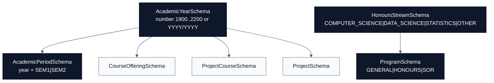

# Academics Schemas

[Docs home](./README.md) | [Public API](./public-api.md) | [Courses](./courses.md) | [People](./people.md) | [Projects](./projects.md) | [Research](./research.md)

The academics domain contains reusable academic calendar and programme shapes.
It is intentionally small and is consumed by [Courses](./courses.md) and
[Projects](./projects.md).

## Quick Read

| Schema                 | Purpose                              | Key Rule                                          |
| ---------------------- | ------------------------------------ | ------------------------------------------------- |
| `AcademicYearSchema`   | Numeric or range-based academic year | Range strings must be `YYYY/YYYY` and sequential. |
| `AcademicPeriodSchema` | Academic year plus semester          | Semester is limited to `SEM1` or `SEM2`.          |
| `ProgramSchema`        | Degree programme variant             | Discriminated by `code`.                          |
| `HonoursStreamSchema`  | Honours stream vocabulary            | Controlled enum shared by honours programmes.     |

## Source Files

- [`academic-year.schema.ts`](../src/schemas/academics/academic-year.schema.ts)
- [`academic-period.schema.ts`](../src/schemas/academics/academic-period.schema.ts)
- [`academic-program.schema.ts`](../src/schemas/academics/academic-program.schema.ts)

## Relationship Diagram

## Schemas

### AcademicYearSchema

Accepts either:

- an integer academic year between `1900` and `2200`,
- a range string in `YYYY/YYYY` format where the second year immediately follows
  the first year.

Use it whenever data needs a year marker but different repositories may still
send either compact numeric years or explicit ranges.

### AcademicPeriodSchema

Combines `AcademicYearSchema` with a semester enum:

- `SEM1`
- `SEM2`

Use it for time slices that require both the academic year and the semester.

### HonoursStreamSchema

Controlled honours streams:

- `COMPUTER_SCIENCE`
- `DATA_SCIENCE`
- `STATISTICS`
- `OTHER`

### ProgramSchema

Discriminated by `code`:

- `GENERAL`: `BSc`, 3 years.
- `HONOURS`: `BSc(Hons)`, 4 years, requires `honoursStream`.
- `SOR`: `BSc(Hons) SOR`, 4 years.

## Future Notes

- Add new semesters only after checking consumers that assume `SEM1` and `SEM2`.
- Add programme variants through `ProgramSchema` so downstream code can safely
  branch on the `code` discriminator.
- Keep year formats conservative because public data and project records depend
  on stable parsing.
