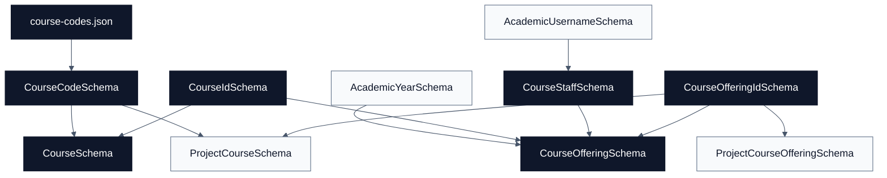

# Courses Schemas

[Docs home](./README.md) | [Public API](./public-api.md) | [Academics](./academics.md) | [People](./people.md) | [Projects](./projects.md) | [Research](./research.md)

The courses domain models the controlled course catalog and academic-year
offerings. It depends on [Academics](./academics.md) for years and on
[People](./people.md) for staff usernames.

## Quick Read

| Schema                 | Purpose                           | Key Rule                                                |
| ---------------------- | --------------------------------- | ------------------------------------------------------- |
| `CourseCodeSchema`     | Controlled course code vocabulary | Values come from `course-codes.json`.                   |
| `CourseSchema`         | Catalog course identity           | `primaryCode` must be included in `codes`.              |
| `CourseStaffSchema`    | Course staff assignment           | Staff identity is an academic username.                 |
| `CourseOfferingSchema` | Year and semester delivery        | Connects course ID, academic year, semester, and staff. |

## Source Files

- [`course-codes.json`](../src/schemas/courses/course-codes.json)
- [`course-code.schema.ts`](../src/schemas/courses/course-code.schema.ts)
- [`course.schema.ts`](../src/schemas/courses/course.schema.ts)
- [`course-staff.schema.ts`](../src/schemas/courses/course-staff.schema.ts)
- [`course-offering.schema.ts`](../src/schemas/courses/course-offering.schema.ts)

## Relationship Diagram

## Schemas

### CourseCodeSchema

Backed by [`course-codes.json`](../src/schemas/courses/course-codes.json).
Only codes in that JSON list are valid.

### CourseIdSchema

Lowercase slug-like ID:

- one or more lowercase letters or numbers,
- hyphen-separated segments allowed,
- no spaces or uppercase letters.

### CourseSchema

Represents a course catalog entry:

- `id`: `CourseIdSchema`.
- `primaryCode`: `CourseCodeSchema`.
- `codes`: one or more course codes.
- `title`: non-empty string.
- `credits`: exactly `1`, `2`, `3`, or `6`.

Rules:

- `primaryCode` must be present in `codes`.
- `codes` cannot contain duplicates.

### CourseStaffSchema

Maps a staff username to a course role:

- `COURSE_COORDINATOR`
- `LECTURER`
- `INSTRUCTOR`
- `TEACHING_ASSISTANT`

The `staff` field uses `AcademicUsernameSchema` from
[People](./people.md).

### CourseOfferingSchema

Represents a specific course delivery:

- `id`: `CourseOfferingIdSchema`.
- `courseId`: `CourseIdSchema`.
- `academicYear`: `AcademicYearSchema`.
- `semester`: `SEM1` or `SEM2`.
- `staff`: array of `CourseStaffSchema`.

## Future Notes

- Treat courses as catalog identity and offerings as yearly delivery instances.
- Course project records should point at offerings through
  `courseOffering.id`; see [Projects](./projects.md).
- Update `course-codes.json` before using a new code in catalog, staff, staff
  teaching, or project data.
