# People Schemas

[Docs home](./README.md) | [Public API](./public-api.md) | [Academics](./academics.md) | [Courses](./courses.md) | [Projects](./projects.md) | [Research](./research.md)

The people domain covers shared identity fields, public search entries, social
links, students, and staff subtypes.

## Quick Read

| Area          | Owns                                                      | Watch For                                                            |
| ------------- | --------------------------------------------------------- | -------------------------------------------------------------------- |
| Identity      | `PersonSchema`, `AcademicUsernameSchema`, `SNumberSchema` | Usernames normalize to lowercase; S-numbers stay strict.             |
| Public search | `PeopleSearchEntrySchema`, `PeopleSearchIndexSchema`      | Keep search entries lightweight and public-safe.                     |
| Social links  | `SocialLinksSchema`, helpers, icons                       | Known platforms are normalized; malformed profile URLs are rejected. |
| Students      | `StudentSchema` and placement/supporting schemas          | General undergraduates cannot be placed at 4000 level.               |
| Staff         | `StaffSchema` and three staff subtype schemas             | `staffType` is the discriminator.                                    |

## Source Files

- [`person.schema.ts`](../src/schemas/people/person.schema.ts)
- [`identifiers/academic-username.schema.ts`](../src/schemas/people/identifiers/academic-username.schema.ts)
- [`identifiers/s-number.schema.ts`](../src/schemas/people/identifiers/s-number.schema.ts)
- [`people-search.schema.ts`](../src/schemas/people/people-search.schema.ts)
- [`social-links.schema.ts`](../src/schemas/people/social-links.schema.ts)
- [`students/student.schema.ts`](../src/schemas/people/students/student.schema.ts)
- [`staff/staff.schema.ts`](../src/schemas/people/staff/staff.schema.ts)
- [`staff/academic-teaching/academic-rank.schema.ts`](../src/schemas/people/staff/academic-teaching/academic-rank.schema.ts)
- [`staff/academic-teaching/academic-teaching-staff.schema.ts`](../src/schemas/people/staff/academic-teaching/academic-teaching-staff.schema.ts)
- [`staff/academic-support/academic-support-position.schema.ts`](../src/schemas/people/staff/academic-support/academic-support-position.schema.ts)
- [`staff/academic-support/academic-support-staff.schema.ts`](../src/schemas/people/staff/academic-support/academic-support-staff.schema.ts)
- [`staff/non-academic/non-academic-position.schema.ts`](../src/schemas/people/staff/non-academic/non-academic-position.schema.ts)
- [`staff/non-academic/non-academic-staff.schema.ts`](../src/schemas/people/staff/non-academic/non-academic-staff.schema.ts)

## Relationship Diagram

```mermaid
%%{init: {"theme": "base", "themeVariables": {"primaryColor": "#f8fafc", "primaryTextColor": "#0f172a", "primaryBorderColor": "#64748b", "lineColor": "#475569"}}}%%
flowchart TD
  PersonSchema["PersonSchema"]
  AcademicUsernameSchema["AcademicUsernameSchema"]
  SNumberSchema["SNumberSchema"]
  SocialLinksSchema["SocialLinksSchema"]
  PeopleSearchEntrySchema["PeopleSearchEntrySchema"]
  StudentSchema["StudentSchema"]
  StaffSchema["StaffSchema"]
  AcademicTeachingStaffSchema["AcademicTeachingStaffSchema"]
  AcademicSupportStaffSchema["AcademicSupportStaffSchema"]
  NonAcademicStaffSchema["NonAcademicStaffSchema"]
  AcademicRankSchema["AcademicRankSchema"]
  AcademicSupportPositionSchema["AcademicSupportPositionSchema"]
  NonAcademicPositionSchema["NonAcademicPositionSchema"]
  PublicationSchema["PublicationSchema"]
  ResearchSchema["ResearchSchema"]
  ConferenceSchema["ConferenceSchema"]
  CourseCodeSchema["CourseCodeSchema"]
  ProjectPersonSchema["ProjectPersonSchema"]
  CourseStaffSchema["CourseStaffSchema"]

  PersonSchema --> StudentSchema
  PersonSchema --> AcademicTeachingStaffSchema
  PersonSchema --> AcademicSupportStaffSchema
  PersonSchema --> NonAcademicStaffSchema
  SNumberSchema --> StudentSchema
  SocialLinksSchema --> StudentSchema
  SocialLinksSchema --> AcademicTeachingStaffSchema
  AcademicRankSchema --> AcademicTeachingStaffSchema
  AcademicSupportPositionSchema --> AcademicSupportStaffSchema
  NonAcademicPositionSchema --> NonAcademicStaffSchema
  AcademicTeachingStaffSchema --> StaffSchema
  AcademicSupportStaffSchema --> StaffSchema
  NonAcademicStaffSchema --> StaffSchema
  PublicationSchema --> StudentSchema
  PublicationSchema --> AcademicTeachingStaffSchema
  ResearchSchema --> AcademicTeachingStaffSchema
  ConferenceSchema --> AcademicTeachingStaffSchema
  CourseCodeSchema --> AcademicTeachingStaffSchema
  AcademicUsernameSchema --> CourseStaffSchema
  AcademicUsernameSchema --> ProjectPersonSchema
  SNumberSchema --> ProjectPersonSchema

  click PublicationSchema "./research.md" "Publication docs"
  click ResearchSchema "./research.md" "Research docs"
  click ConferenceSchema "./research.md" "Conference docs"
  click CourseCodeSchema "./courses.md" "Course code docs"
  click ProjectPersonSchema "./projects.md" "Project person docs"
  click CourseStaffSchema "./courses.md" "Course staff docs"

  classDef people fill:#0f172a,color:#ffffff,stroke:#0f172a
  classDef external fill:#f8fafc,color:#0f172a,stroke:#64748b
  class PersonSchema,AcademicUsernameSchema,SNumberSchema,SocialLinksSchema,PeopleSearchEntrySchema,StudentSchema,StaffSchema,AcademicTeachingStaffSchema,AcademicSupportStaffSchema,NonAcademicStaffSchema,AcademicRankSchema,AcademicSupportPositionSchema,NonAcademicPositionSchema people
  class PublicationSchema,ResearchSchema,ConferenceSchema,CourseCodeSchema,ProjectPersonSchema,CourseStaffSchema external
```

## Shared Identity

### PersonSchema

Common profile base:

- `title`: `Mr`, `Mrs`, `Ms`, `Dr`, or `Prof`.
- `fullName`: string.
- `email`: optional email.
- `profileImageUrl`: optional URL.
- `mobilePhone`: optional string.

### AcademicUsernameSchema

Normalizes by trimming and lowercasing. Valid usernames:

- start with a letter,
- contain lowercase letters, numbers, dots, or underscores,
- are 3 to 30 characters.

Used by [Courses](./courses.md) and [Projects](./projects.md).

### SNumberSchema

Valid formats:

- `SYYXXX`
- `SYYSPXXX`

Used by `StudentSchema` and project people.

## Search

### PeopleSearchEntrySchema

Public search index entry:

- `type`: `STAFF` or `STUDENT`.
- `identity`: lowercased searchable identity.
- `href`: `/people/<id>` style route.
- `keywords`: one or more normalized search terms.

### PeopleSearchIndexSchema

Array of `PeopleSearchEntrySchema`.

## Social Links

### SocialLinksSchema

Normalizes known social platforms and keeps unknown platforms under
`otherPlatforms`.

Known platforms:

- `linkedin`
- `github`
- `mastodon`
- `bluesky`
- `x`
- `facebook`
- `instagram`
- `youtube`

Helpers:

- `normalizeKnownSocialUrl(platform, value)`
- `detectKnownSocialUrl(value)`

`SocialIconSchema` supports Simple Icons, Font Awesome brands, and custom icon
URLs.

## Students

### StudentSchema

Extends `PersonSchema` with:

- `registrationNo`: `SNumberSchema`.
- `studentType`: `UNDERGRADUATE` or `POSTGRADUATE`.
- optional undergraduate fields: `studentTrack`, `level`.
- optional postgraduate fields: `postgraduateProgramme`, `slqfLevel`.
- `status`: `CURRENT` or `ALUMNI`.
- optional profile data: personal email, research interests, publications,
  positions, and social links.

Supporting schemas:

- `StudentPlacementSchema`: batch, track, and level.
- `StudentPlacementListSchema`
- `AlumniBatchSchema`
- `AlumniBatchListSchema`
- `PostgraduateProgrammeDefinitionSchema`
- `PostgraduateProgrammeDefinitionListSchema`
- `StudentStreamDefinitionSchema`
- `StudentStreamDefinitionListSchema`

Important rule: `GENERAL` undergraduate placements cannot use `4000` level.

## Staff

### StaffSchema

Discriminated union by `staffType`:

- `ACADEMIC_TEACHING`
- `ACADEMIC_SUPPORT`
- `NON_ACADEMIC`

### AcademicTeachingStaffSchema

Extends `PersonSchema` and requires `academicRank`. It can also include
qualifications, office details, awards, website, research interests, ongoing
research, publications, key publications, conferences, teaching course codes,
CV URL, and social links.

### AcademicSupportStaffSchema

Extends `PersonSchema` and requires `designation` from
`AcademicSupportPositionSchema`.

### NonAcademicStaffSchema

Extends `PersonSchema` and requires `designation` from
`NonAcademicPositionSchema`.

## Future Notes

- Keep staff and student profile data separate from search-index data. Search is
  intentionally lightweight.
- Add new staff subtypes through the `StaffSchema` discriminator.
- Keep social link normalization strict because it protects public profile data
  from malformed or non-profile URLs.
