# Projects Schemas

[Docs home](./README.md) | [Public API](./public-api.md) | [Academics](./academics.md) | [Courses](./courses.md) | [People](./people.md) | [Research](./research.md)

The projects domain models records in the shared project registry. Projects are
project-first: course, category, tag, and people metadata describe a project but
do not replace project identity.

## Quick Read

| Schema                | Purpose                | Key Rule                                              |
| --------------------- | ---------------------- | ----------------------------------------------------- |
| `ProjectSchema`       | Main registry record   | `COURSE_PROJECT` requires `courseOffering`.           |
| `ProjectPersonSchema` | Participant reference  | Can use username, email, or S-number.                 |
| `ProjectCourseSchema` | Course-facing metadata | Uses controlled course code and optional offering ID. |
| `ProjectDatesSchema`  | Timeline metadata      | `completedAt` cannot be before `startedAt`.           |
| `ProjectSourceSchema` | Source provenance      | Discriminated by `kind`.                              |

## Source File

- [`project.schema.ts`](../src/schemas/projects/project.schema.ts)

## Relationship Diagram

```mermaid
%%{init: {"theme": "base", "themeVariables": {"primaryColor": "#f8fafc", "primaryTextColor": "#0f172a", "primaryBorderColor": "#64748b", "lineColor": "#475569"}}}%%
flowchart TD
  ProjectSchema["ProjectSchema"]
  ProjectTypeSchema["ProjectTypeSchema"]
  ProjectStatusSchema["ProjectStatusSchema"]
  ProjectPersonSchema["ProjectPersonSchema"]
  ProjectLinksSchema["ProjectLinksSchema"]
  ProjectSourceSchema["ProjectSourceSchema"]
  ProjectMediaSchema["ProjectMediaSchema"]
  ProjectDatesSchema["ProjectDatesSchema"]
  ProjectCourseSchema["ProjectCourseSchema"]
  ProjectCourseOfferingSchema["ProjectCourseOfferingSchema"]
  AcademicYearSchema["AcademicYearSchema"]
  CourseCodeSchema["CourseCodeSchema"]
  CourseOfferingIdSchema["CourseOfferingIdSchema"]
  AcademicUsernameSchema["AcademicUsernameSchema"]
  SNumberSchema["SNumberSchema"]

  ProjectTypeSchema --> ProjectSchema
  ProjectStatusSchema --> ProjectSchema
  ProjectPersonSchema --> ProjectSchema
  ProjectLinksSchema --> ProjectSchema
  ProjectSourceSchema --> ProjectSchema
  ProjectMediaSchema --> ProjectSchema
  ProjectDatesSchema --> ProjectSchema
  ProjectCourseSchema --> ProjectSchema
  ProjectCourseOfferingSchema --> ProjectSchema
  AcademicYearSchema --> ProjectSchema
  AcademicYearSchema --> ProjectCourseSchema
  CourseCodeSchema --> ProjectCourseSchema
  CourseOfferingIdSchema --> ProjectCourseSchema
  CourseOfferingIdSchema --> ProjectCourseOfferingSchema
  AcademicUsernameSchema --> ProjectPersonSchema
  SNumberSchema --> ProjectPersonSchema

  click AcademicYearSchema "./academics.md" "Academic year docs"
  click CourseCodeSchema "./courses.md" "Course code docs"
  click CourseOfferingIdSchema "./courses.md" "Course offering docs"
  click AcademicUsernameSchema "./people.md" "Academic username docs"
  click SNumberSchema "./people.md" "S-number docs"

  classDef project fill:#0f172a,color:#ffffff,stroke:#0f172a
  classDef external fill:#f8fafc,color:#0f172a,stroke:#64748b
  class ProjectSchema,ProjectTypeSchema,ProjectStatusSchema,ProjectPersonSchema,ProjectLinksSchema,ProjectSourceSchema,ProjectMediaSchema,ProjectDatesSchema,ProjectCourseSchema,ProjectCourseOfferingSchema project
  class AcademicYearSchema,CourseCodeSchema,CourseOfferingIdSchema,AcademicUsernameSchema,SNumberSchema external
```

## Top-Level Project

### ProjectSchema

Main registry record:

- `id`: non-empty string.
- `slug`: lowercase slug-like identifier.
- `title`: non-empty string.
- `shortDescription`: non-empty string.
- `description`: non-empty string.
- `projectType`: `ProjectTypeSchema`.
- `status`: `ProjectStatusSchema`.
- `categories`: one or more non-empty strings.
- `tags`: array of strings, defaults to an empty array.
- `academicYear`: optional `AcademicYearSchema`.
- `course`: optional `ProjectCourseSchema`.
- `courseOffering`: optional `ProjectCourseOfferingSchema`.
- `batch`: optional string.
- `groupNumber`: optional string.
- `people`: one or more `ProjectPersonSchema` entries.
- `links`: `ProjectLinksSchema`, defaults to an empty object.
- `source`: `ProjectSourceSchema`.
- `media`: `ProjectMediaSchema`.
- `dates`: `ProjectDatesSchema`.

Important rule: `COURSE_PROJECT` records must include `courseOffering`.

## Supporting Schemas

### ProjectTypeSchema

Allowed project types:

- `COURSE_PROJECT`
- `RESEARCH_PROJECT`
- `STUDENT_INNOVATION`
- `OPEN_SOURCE`
- `DEPARTMENT_SYSTEM`
- `DATASET`
- `PUBLICATION_ARTIFACT`
- `INDUSTRY_COLLABORATION`
- `FACULTY_COLLABORATION`
- `HACKATHON`
- `OTHER`

### ProjectStatusSchema

Allowed statuses:

- `PLANNED`
- `ACTIVE`
- `COMPLETED`
- `ARCHIVED`

### ProjectPersonSchema

Describes a project participant:

- `name`: required.
- `role`: `student`, `supervisor`, `instructor`, `maintainer`,
  `collaborator`, or `contributor`.
- `username`: optional `AcademicUsernameSchema`.
- `email`: optional email.
- `sNumber`: optional `SNumberSchema`.

### ProjectLinksSchema

Optional URLs:

- repository
- website
- documentation
- demo
- dataset
- publication
- video

### ProjectSourceSchema

Discriminated by `kind`:

- `TEMPLATE_INDEX_JSON`
- `MANUAL`
- `GITHUB_REPO`

### ProjectMediaSchema

Requires `icon`; accepts optional `coverImage`.

### ProjectDatesSchema

Requires `lastUpdatedAt`. Optional `startedAt` and `completedAt` must keep
`completedAt` on or after `startedAt`.

### ProjectCourseSchema

Course-facing project metadata:

- optional `courseId`,
- optional `offeringId`,
- required `code`,
- required `title`,
- optional `academicYear`,
- optional `semester`.

### ProjectCourseOfferingSchema

Minimal reference to a controlled course offering:

- `id`: `CourseOfferingIdSchema`.

## Future Notes

- Do not use courses, categories, or tags as project identity. The project slug
  and ID remain the primary identity.
- Keep course-project validation aligned with [Courses](./courses.md).
- Keep `ProjectPersonSchema` flexible enough to reference people by username,
  email, or S-number because not every contributor has the same identity source.
