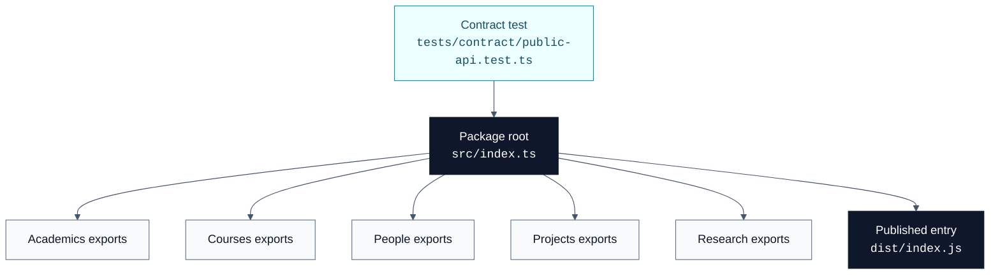

# Public API

[Docs home](./README.md) | [Academics](./academics.md) | [Courses](./courses.md) | [People](./people.md) | [Projects](./projects.md) | [Research](./research.md)

The public package surface is the root barrel:
[`src/index.ts`](../src/index.ts). Consumers should import from the package root
instead of internal files.

```ts
import { StudentSchema } from '@csc3213-2026-group-b/academic-domain-schemas';
```

## API Map



## Export Inventory

Every schema file under `src/schemas/**/*.ts` is exported from
[`src/index.ts`](../src/index.ts). The runtime export list is guarded by
[`public-api.test.ts`](../tests/contract/public-api.test.ts).

| Domain                      | Runtime Schemas And Helpers                                                                                                                                                                                                                                                                                                                                                                                                                                                                                                                                                                                                                                                                                                                                                                                                                                                                                                          | Type Exports                                                                                                                                                                                                                                                                                                                                                                                                                                                                                                                                      |
| --------------------------- | ------------------------------------------------------------------------------------------------------------------------------------------------------------------------------------------------------------------------------------------------------------------------------------------------------------------------------------------------------------------------------------------------------------------------------------------------------------------------------------------------------------------------------------------------------------------------------------------------------------------------------------------------------------------------------------------------------------------------------------------------------------------------------------------------------------------------------------------------------------------------------------------------------------------------------------ | ------------------------------------------------------------------------------------------------------------------------------------------------------------------------------------------------------------------------------------------------------------------------------------------------------------------------------------------------------------------------------------------------------------------------------------------------------------------------------------------------------------------------------------------------- |
| [Academics](./academics.md) | `AcademicPeriodSchema`, `HonoursStreamSchema`, `ProgramSchema`, `AcademicYearSchema`                                                                                                                                                                                                                                                                                                                                                                                                                                                                                                                                                                                                                                                                                                                                                                                                                                                 | `AcademicPeriod`, `Program`, `AcademicYear`                                                                                                                                                                                                                                                                                                                                                                                                                                                                                                       |
| [Courses](./courses.md)     | `CourseIdSchema`, `CourseSchema`, `CourseCodeSchema`, `CourseOfferingIdSchema`, `CourseOfferingSchema`, `CourseStaffSchema`                                                                                                                                                                                                                                                                                                                                                                                                                                                                                                                                                                                                                                                                                                                                                                                                          | `CourseId`, `Course`, `CourseCode`, `CourseOfferingId`, `CourseOffering`, `CourseStaff`                                                                                                                                                                                                                                                                                                                                                                                                                                                           |
| [People](./people.md)       | `AcademicUsernameSchema`, `SNumberSchema`, `PeopleSearchEntryTypeSchema`, `PeopleSearchEntrySchema`, `PeopleSearchIndexSchema`, `PersonSchema`, `KnownSocialPlatforms`, `KnownSocialIcons`, `normalizeKnownSocialUrl`, `detectKnownSocialUrl`, `SocialIconSchema`, `SocialLinksSchema`, `AcademicSupportPositionSchema`, `AcademicSupportStaffSchema`, `AcademicRankSchema`, `AcademicTeachingStaffSchema`, `NonAcademicPositionSchema`, `NonAcademicStaffSchema`, `StaffSchema`, `StudentTypeSchema`, `StudentTrackSchema`, `StudentLevelSchema`, `StudentStatusSchema`, `PostgraduateProgrammeSchema`, `SlqfLevelSchema`, `StudentStreamSchema`, `StudentPlacementSchema`, `StudentPlacementListSchema`, `AlumniBatchSchema`, `AlumniBatchListSchema`, `PostgraduateProgrammeDefinitionSchema`, `PostgraduateProgrammeDefinitionListSchema`, `StudentStreamDefinitionSchema`, `StudentStreamDefinitionListSchema`, `StudentSchema` | `AcademicUsername`, `SNumber`, `PeopleSearchEntryType`, `PeopleSearchEntry`, `PeopleSearchIndex`, `Person`, `KnownSocialPlatform`, `SocialIcon`, `SocialLinks`, `AcademicSupportPosition`, `AcademicSupportStaff`, `AcademicRank`, `AcademicTeachingStaff`, `NonAcademicPosition`, `NonAcademicStaff`, `Staff`, `StudentType`, `StudentTrack`, `StudentLevel`, `StudentStatus`, `PostgraduateProgramme`, `SlqfLevel`, `StudentStream`, `StudentPlacement`, `AlumniBatch`, `PostgraduateProgrammeDefinition`, `StudentStreamDefinition`, `Student` |
| [Projects](./projects.md)   | `ProjectTypeSchema`, `ProjectStatusSchema`, `ProjectPersonRoleSchema`, `ProjectPersonSchema`, `ProjectLinksSchema`, `ProjectSourceSchema`, `ProjectMediaSchema`, `ProjectDatesSchema`, `ProjectCourseSchema`, `ProjectCourseOfferingSchema`, `ProjectSchema`                                                                                                                                                                                                                                                                                                                                                                                                                                                                                                                                                                                                                                                                         | `ProjectType`, `ProjectStatus`, `ProjectPersonRole`, `ProjectPerson`, `ProjectLinks`, `ProjectSource`, `ProjectMedia`, `ProjectDates`, `ProjectCourse`, `ProjectCourseOffering`, `Project`                                                                                                                                                                                                                                                                                                                                                        |
| [Research](./research.md)   | `ConferenceSchema`, `ResearchSchema`, `PublicationSchema`                                                                                                                                                                                                                                                                                                                                                                                                                                                                                                                                                                                                                                                                                                                                                                                                                                                                            | `Conference`, `Research`, `Publication`                                                                                                                                                                                                                                                                                                                                                                                                                                                                                                           |

## Release Safety

| Check                    | Why It Matters                                                                      |
| ------------------------ | ----------------------------------------------------------------------------------- |
| `bun run typecheck`      | Validates source aliases and emitted declarations.                                  |
| `bun run typecheck:test` | Validates tests and editor-facing test imports.                                     |
| `bun test --coverage`    | Confirms schema behavior and export inventory.                                      |
| `bun run build`          | Compiles package output and rewrites `@/...` aliases to runtime-safe `.js` imports. |
| `bun run knip`           | Catches unresolved imports and unused public files.                                 |

## Build Note

Source files use `@/...` aliases and extensionless imports. The build runs
`tsc-alias` after TypeScript compilation so published `dist` files use relative
`.js` imports that Node ESM can load.
