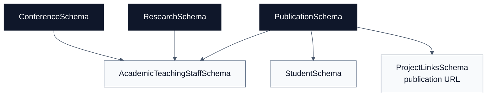

# Research Schemas

[Docs home](./README.md) | [Public API](./public-api.md) | [Academics](./academics.md) | [Courses](./courses.md) | [People](./people.md) | [Projects](./projects.md)

The research domain contains reusable research activity shapes used mostly by
people profiles. It is deliberately lightweight: richer research systems can
compose these records without forcing every public profile to carry a large
research model.

## Quick Read

| Schema              | Purpose                             | Main Consumers                                   |
| ------------------- | ----------------------------------- | ------------------------------------------------ |
| `ConferenceSchema`  | Conference attendance/profile entry | Academic teaching staff                          |
| `ResearchSchema`    | Ongoing or past research activity   | Academic teaching staff                          |
| `PublicationSchema` | Publication metadata                | Students, academic teaching staff, project links |

## Source Files

- [`conference.schema.ts`](../src/schemas/research/conference.schema.ts)
- [`research.schema.ts`](../src/schemas/research/research.schema.ts)
- [`research-publication.schema.ts`](../src/schemas/research/research-publication.schema.ts)

## Relationship Diagram

## Schemas

### ConferenceSchema

Conference profile entry:

- `name`: required.
- `date`: required string.
- `location`: optional.
- `description`: optional.
- `icon`: optional URL.

### ResearchSchema

Research activity entry:

- `title`: required.
- `description`: optional.
- `startDate`: required string.
- `endDate`: optional.
- `icon`: optional URL.
- `website`: optional URL.

### PublicationSchema

Publication entry:

- `title`: required.
- `journal`: optional.
- `publicationDate`: optional.
- `coAuthors`: optional array of strings.
- `description`: optional.
- `doi`: optional object with `doiId` and `doiUrl`.
- `url`: optional URL.
- `icon`: optional URL.

## Future Notes

- Keep dates as strings unless every consumer is ready for stricter ISO date
  validation.
- Keep publications reusable by students and staff.
- If research records become externally managed, introduce a stable identifier
  before adding cross-repository references.
